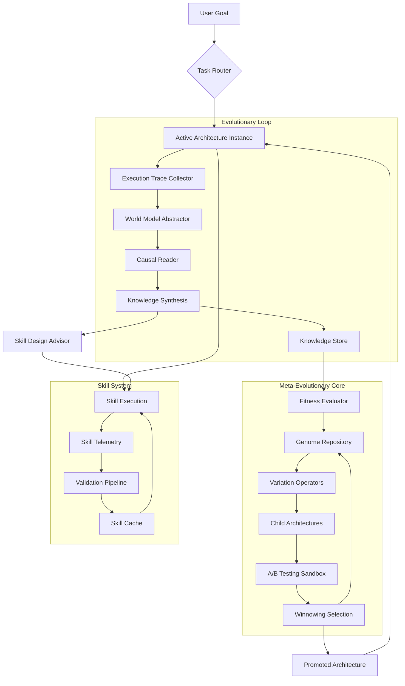

# EvoForge Architecture: Self-Evolving AI Agent Framework

## Vision Statement

EvoForge is a meta-morphic AI agent framework that continuously evolves its own architecture through operational experience, transcending traditional static agent designs. Unlike frameworks that simply learn new skills or improve existing ones, EvoForge autonomously redesigns its internal components—selection algorithms, memory hierarchies, and planning strategies—to optimize for emerging environmental demands.

**Core Thesis**: An agent's architecture should not be a fixed blueprint but an evolvable phenotype, shaped by iterative variation, selection, and retention of successful configurations.

---

## Unique Architectural Pillars

### 1. Meta-Evolutionary Core (MEC)

The **Meta-Evolutionary Core** is EvoForge's innovation: a separate agent layer dedicated to evolving the agent framework itself.

**Components:**
- **Architecture Genome**: Encodes the agent's configuration as an evolvable genotype
  - Planning algorithm (e.g., ReAct, Chain-of-Thought, Tree-of-Thoughts)
  - Memory management strategy (vector DB, graph, episodic)
  - Tool selection policy and abstraction layer
  - Learning rate and optimization hyperparameters
  - Self-monitoring and evaluation frequency

- **Variation Operators**: Introduce architectural mutations
  - Crossover between successful agent configurations
  - Structural mutations (add/remove/replace components)
  - Parameter mutations with adaptive step sizes
  - Topology changes (connectivity between modules)

- **Fitness Evaluator**: Assesses architectural changes quantitatively
  - Multi-objective: task success rate, sample efficiency, compute cost, interpretability
  - Rolling baselines prevent regression
  - Automated A/B testing in parallel sandbox environments

**How It Differs**: Existing frameworks evolve skills or policies within a fixed architecture. MEC evolves the architecture itself—the principles that generate skills and policies.

---

### 2. Convergent Knowledge Synthesis Engine (CKSE)

Inspired by HealthFlow's ExperienceManager and SEAgent's World State Model, CKSE performs **explicit knowledge distillation across evolution cycles**.

**Pipeline:**

```
Execution → Raw Trajectories
    ↓
World Model → State Abstraction (What actually happened?)
    ↓
Reader → Causal & Procedural Extraction (Why did it work/fail?)
    ↓
Synthesis → Composite Knowledge Units (Cross-architectural insights)
    ↓
Re-encoding → Genome Annotation (Tunable architecture parameters)
```

**Key Innovations:**
- **Cross-Architecture Generalization**: Knowledge extracted from a "ReAct" architecture can inform improvements in a "Tree-of-Thoughts" agent
- **Causal Trace Reconstruction**: Uses a dedicated LLM to infer causal relationships between architectural changes and outcomes
- **Knowledge-Directed Mutation**: Architectural mutations are guided by synthesized knowledge, not random variation

**Novelty**: Most frameworks learn within-architectures. CKSE learns *about* architectures, enabling genuine metaevolution.

---

### 3. Skill Crystallization Cache with Chaîne of Validation

EvoForge implements an advanced skill lifecycle inspired by Moltron's crystallization but with formal guarantees.

**Skill States:**
1. **Prototype** (0-5 executions): Casual logs only
2. **Candidate** (5-50 executions): Basic telemetry, sandbox testing required
3. **Crystallized** (50+ executions): Immutable, versioned, production-certified
4. **Archived** (retired): Read-only access, triggers deprecation warnings

**Validation Pipeline (Chaîne):**
```
Pull Request → Unit Tests → Integration Tests → A/B Shadow Mode
    → Canary Rollout → Performance Regression Detection → Promoted
```

**Evolutionary Retention**: Even discarded skills are retained in "dead code museum" for possible resurrection through genome crossover.

---

### 4. Divergent Task Curriculum Generator

Borrowing from SEAgent's curriculum learner, but with explicit **evolutionary objectives**.

**Curriculum Loop:**
1. **Gap Analysis**: Identify tasks where current architecture underperforms
   - Compare fitness function component deviations
   - Detect performance plateaus across skill categories
2. **Probe Generation**: Create edge cases specifically targeting identified gaps
   - Use LLM to generate tasks that would stress weak architectural components
3. **Progressive Reveal**: Deploy new tasks only when a threshold of skill is reached
   - Prevents catastrophic forgetting during curriculum progression
4. **Founder Effect Mitigation**: Ensure enough task diversity to avoid local optima

**Unique Aspect**: The curriculum exists *to evolve the agent*, not to teach it specific skills. Tasks are chosen based on their potential to generate informative architectural mutations.

---

### 5. Federated Knowledge Pool (Optional Distributed Mode)

Enables multiple EvoForge instances to contribute to and learn from a shared knowledge pool without exposing sensitive data.

**Privacy-Preserving Architecture:**
- Each instance shares **abstracted knowledge units**, not raw trajectories
- Differential privacy noise added to cross-instance contributions
- Reputation-weighted voting in consensus mechanisms
- Knowledge provenance tracked via cryptographic signatures

**Use Cases**:
- Consortium-based evolution where organizations mutually benefit without sharing proprietary data
- Open-source "commons" of evolved architectures published by the community

---

## Data Flow & Component Interactions



**Data Invarants:**
- **Traceability**: Every architectural decision links back to specific execution evidence
- **Reversibility**: Architecture rollbacks permitted using genome history
- **Safety**: Mutations evaluated in isolated sandbox before production deployment
- **Knowledge Conservation**: No insight discarded; poorly-performing architectures contribute to training data

---

## Evolutionary Strategy Design

### Selection Mechanism

**Multi-Tournament Selection with Diversity Bonus:**

```
population = active_architectures
selected = []

for tournament in parallel_tournaments:
    contestants = sample_with_diversity_bonus(population, k=8)
    winner = argmax_{c in contestants} (fitness(c) + λ * novelty(c))
    selected.append(winner)
```

- **Fitness**: Weighted sum of success rate, efficiency, interpretability scores
- **Novelty**: Distance to nearest neighbor in architectural feature space
- **λ**: Tunable diversity pressure (default 0.3; can evolve itself)

### Crossover Operator

**Modular Crossover with Constraint Propagation:**

```
parent_A, parent_B = selected_architectures()
child = initialize_from(parent_A)

for module in ALL_MODULES:
    if random() < crossover_rate:
        child[module] = parent_B[module]  # Swap entire modules
        propagate_constraints(child)  # Ensure compatibility
    else:
        child[module] = mutate_parameters(parent_A[module])
```

Constraints ensure, e.g., that selecting a high-throughput memory module pairs with compatible retrieval algorithms.

### Mutation Operators

1. **Parameter Mutation**: Gaussian noise on continuous parameters
2. **Structural Mutation**: Add/remove/replace modules; then re-validate constraints
3. **Topological Mutation**: Rewire inter-module connections
4. **Hypermutation**: Temporary increase in mutation rate when fitness plateaus

---

## Evolution Loop Timing & Phasing

### Phase 1: Exploration (Generations 0–100)
- High mutation rates (0.2–0.5 per genome)
- Small population (16–32 architectures)
- Intensive logging; fitness approx based on synthetic curriculum
- **Goal**: Discover viable architectural regions

### Phase 2: Intensification (Generations 101–500)
- Lower mutation (0.05–0.1), higher crossover
- Larger population (64–128)
- Fitness based on real User Goals (shadow mode only)
- Introduce **niche specialization**: Some architectures target specific goal types
- **Goal**: Refine promising architectures

### Phase 3: Exploitation (Generation 501+)
- Very low mutation (0.01)
- Focus on architecture **ensembles**: Multiple specialized agents voting
- Deploy top architectures to production with canary releases
- Fitness from actual user objectives with automated monitoring
- **Goal**: Optimize for real-world deployment

---

## Novelty Claim: Why EvoForge Is Different

| Aspect | Existing Frameworks | EvoForge |
|--------|---------------------|----------|
| Evolutionary Target | Skills, policies, or plans within fixed architecture | **Architecture itself** (the "genome" of the agent) |
| Knowledge Granularity | Trajectory- or task-specific | **Cross-architectural abstractions** that generalize |
| Selection Mechanism | Reinforcement signals on actions | **Multi-objective fitness on entire agent design** |
| Deployment | Single agent per framework | **Population of heterogeneous agents**, potentially dynamic |
| Meta-Capability | No evolution of evolution mechanism | **Explicit meta-evolution**: evolution parameters are evolved |

**Bottom Line**: EvoForge is not just another self-improving agent—it's a **self-redesigning agent framework** that treats architecture as the evolving unit, not just behavior.

---

## Implementation Roadmap (High-Level)

1. **Genome Representation**: Protobuf/JSON schema for modular agent architecture
2. **Base Architecture Library**: Implement 5–10 baseline modules (planners, memories, selectors)
3. **Variation & Constraint Engine**: With modular compatibility guarantees
4. **World Model**: Abstractor that converts raw traces into comparable state representations
5. **Fitness Function Suite**: Initially based on synthetic benchmarks, later real-world signals
6. **A/B Testing Sandbox**: Isolated execution environments with resource quotas
7. **Genome Repository + Versioning**: Audit trail of all evolutionary steps
8. **Dashboard**: Visualize evolution, inspect knowledge units, manually guide mutations

---

## Evaluation Criteria for Success

After 500 architecture generations (or ~100K task executions), EvoForge should demonstrate:

1. **Rate of Architectural Innovation**: Novel configurations not present in seed population exceed 40% of population
2. **Cross-Task Generalization**: Top architectures score within 15% of task-specific best on held-out task families
3. **Evolution Speed**: Per-generation improvement in aggregate population fitness > 2% over rolling 50-gen window
4. **Knowledge Reuse**: >60% of synthesized knowledge units cited in multiple architectural lineages
5. **Human Interpretability**: At least 3 high-fitness architectures that domain experts can understand and manually replicate

---

## Open Questions & Research Directions

1. **Credit Assignment at Architectural Level**: Which architectural change caused which outcome? Requires advanced causal inference.
2. **Catastrophic Forgetting Mitigation**: How to preserve valuable architecture features across aggressive mutations? Solution: "architectural immune system" that protects high-fitness modules.
3. **Evolutionary Stasis Detection**: When does further variation yield diminishing returns? Early stopping triggers need development.
4. **Safety & Alignment**: How to ensure evolved architectures remain aligned with human values? Requires value alignment fitness constraints.
5. **Scalability**: Population-based architecture evolution is computationally expensive. Hierarchical evolution (evolve modules separately) may be necessary for large frameworks.

---

## Conclusion

EvoForge's architecture is itself an early prototype, expected to evolve significantly under its own evolutionary mechanisms. The ambition is not to build a perfect agent framework up-front, but to build a framework that can discover how to build perfect agent frameworks through sustained operation and experience.

**The ultimate test of EvoForge**: After running it for sufficient time, we should be able to examine the evolved architectures and find ideas we never would have thought of ourselves.


---

*EvoForge AI Framework - Architecture Draft v0.1*
*Based on research of state-of-the-art self-evolving frameworks (March 2026)*