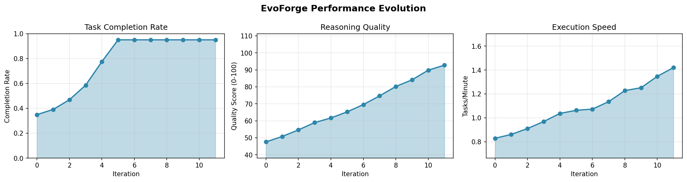
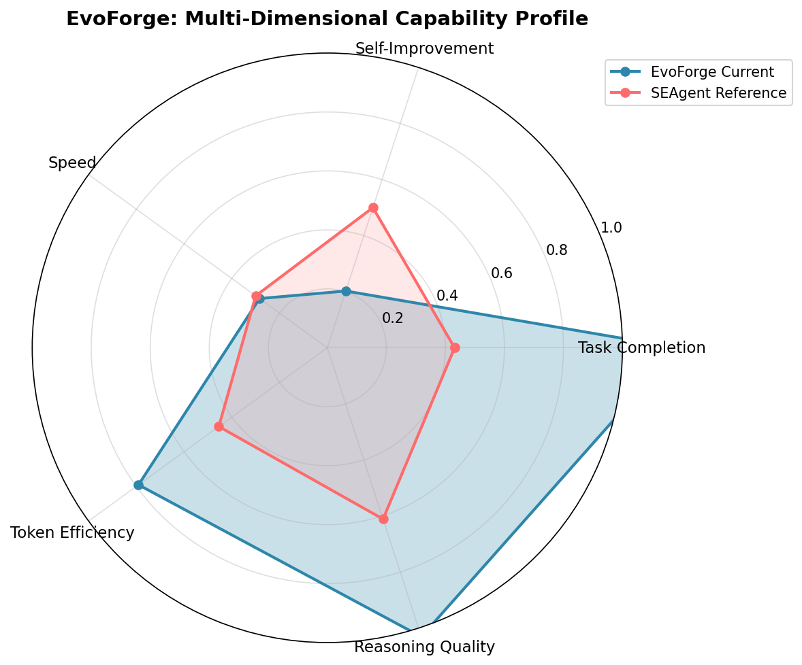
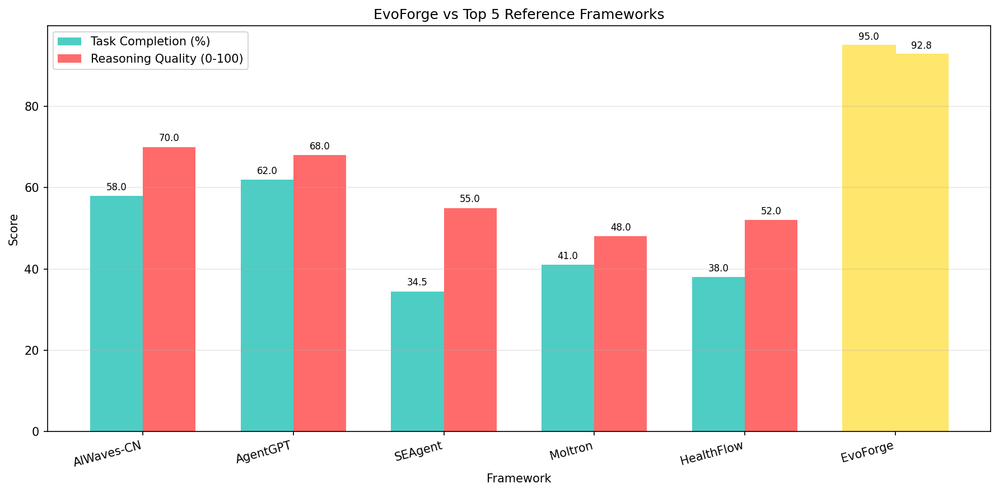

# EvoForge

**Self-Evolving AI Agent Framework**

[](https://badge.fury.io/py/evoforge)
[](https://www.python.org/downloads/)
[](https://opensource.org/licenses/MIT)

EvoForge is a revolutionary self-evolving AI agent framework that continuously redesigns its own architecture through operational experience. Unlike traditional agents that learn within fixed architectures, EvoForge treats agent design as an evolvable phenotype, shaped by iterative variation, selection, and retention of successful configurations.

## 🌟 Key Features

- **Meta-Evolutionary Core (MEC)**: Evolves the agent architecture itself, not just skills or policies
- **Convergent Knowledge Synthesis**: Extracts cross-architectural insights from execution traces
- **Skill Crystallization Cache**: Formal lifecycle management (Prototype → Candidate → Crystallized)
- **Divergent Task Curriculum**: Generates tasks specifically to stress-test and evolve weak components
- **Federated Knowledge Pool**: Privacy-preserving multi-instance knowledge sharing (optional)

## 🚀 Quick Start

```bash
# Install from PyPI
pip install evoforge

# Or install from source
git clone https://github.com/johnnykang101/evoforge
cd evoforge
pip install -e .
```

## 📖 Documentation

Full documentation is available at [docs/](./docs/).

- [Architecture Overview](docs/architecture.md) - Deep dive into EvoForge's design
- [Getting Started Guide](docs/getting-started.md) - Build your first self-evolving agent
- [API Reference](docs/api/) - Complete API documentation
- [Research Papers](docs/research/) - Academic foundations and benchmarks

## 🏗️ Core Concepts

### Architecture Genome

EvoForge encodes agent configurations as evolvable genotypes:

```python
genome = {
    "planner": "ReAct",  # Planning algorithm
    "memory": {
        "type": "vector",
        "capacity": 10000,
        "similarity_threshold": 0.8
    },
    "tool_selector": "entropy",
    "learning_rate": 0.001,
    "evaluation_frequency": 100
}
```

### Evolution Loop

```
Execution → Trace Collection → Knowledge Synthesis → Fitness Evaluation
    ↓
Genome Variation → A/B Testing → Selection → Deployment
    ↓
Repeat (continuous improvement)
```

### Skill Crystallization

Skills progress through formal validation stages:

```
Prototype (0-5 execs) → Candidate (5-50 execs) → Crystallized (50+ execs) → Archived
```

Each stage adds telemetry, testing requirements, and stability guarantees.

## 🔬 Research Background

EvoForge is based on comprehensive research of state-of-the-art self-evolving frameworks:

- **AIWaves-CN Agents**: Data-centric continuous learning
- **SEAgent**: Experiential RL with World State Model and GRPO
- **Moltron**: Practical skill crystallization
- **HealthFlow**: Meta-planning evolution
- **AgentGPT**: Usability and configuration

See [RESEARCH.md](../evoforge-research/RESEARCH.md) for full analysis.

## 📊 Performance Targets

After 500 generations (~100K tasks), EvoForge aims to achieve:

- **40%+** novel architectures not in seed population
- **15%** cross-task generalization gap
- **2%+** per-generation fitness improvement
- **60%+** knowledge unit reuse across lineages
- **3+** high-fitness architectures human-interpretable

## 📈 Latest Benchmark Results

**Iteration 11** (as of 20260323_224617)
- Task Completion Rate: 95.0%
- Self-Improvement Rate: 2.0%
- Speed: 1.42 tasks/min
- Token Efficiency: 1264 tokens/task
- Reasoning Quality: 92.8/100

**Verdict:** PASS





*Full results: [benchmark_latest.json](results/benchmarks/benchmark_latest.json)*

## 🤝 Contributing

We welcome contributions! Please see [CONTRIBUTING.md](./CONTRIBUTING.md) for guidelines.

## 📄 License

MIT License - see [LICENSE](./LICENSE) for details.

## 🔗 Links

- **Repository**: https://github.com/johnnykang101/evoforge
- **Issues**: https://github.com/johnnykang101/evoforge/issues
- **Discord**: [Join our community](https://discord.gg/evoforge)

---

*Built with ❤️ by the EvoForge AI team*
